# CS309-WarChess

This repository contains the front end code of a Warchess game -SUSTechtopia which we made for our Project of course CS309. The code is in C# and we implement it with the unity engine, the back end code is written in java which is currently not open-sourced.

Followings are some screen-shots from the game and some brief descriptions.

 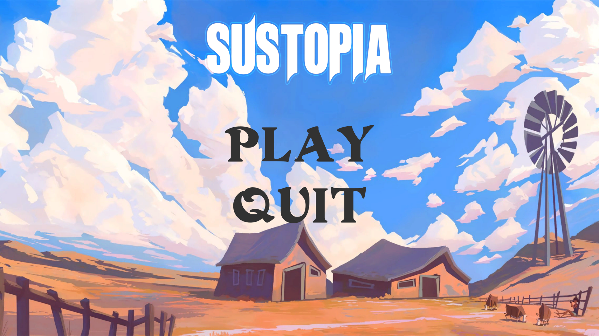

 Register an account and login to play.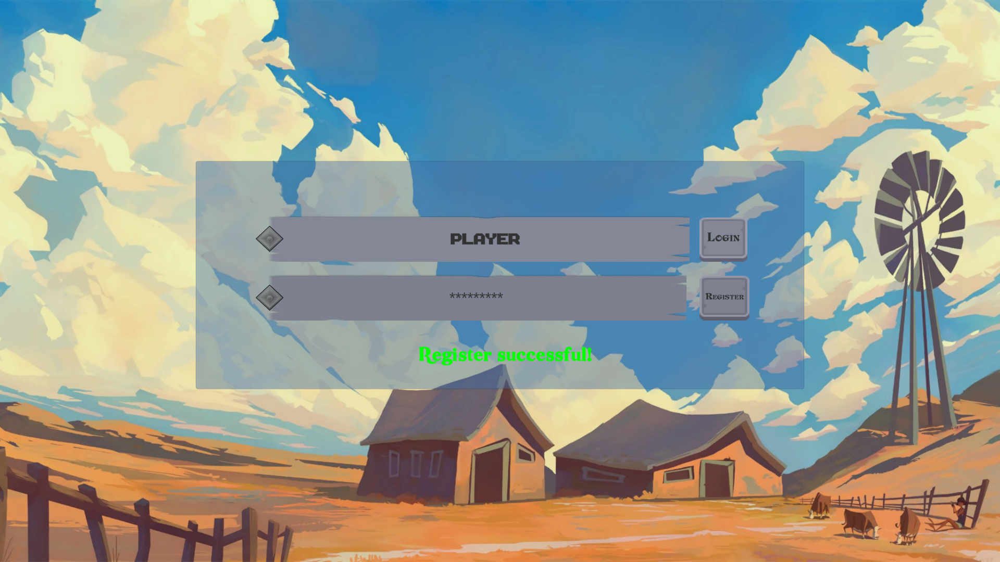

Starting menu, both single player (play with computer AI) and double player mode is supported.

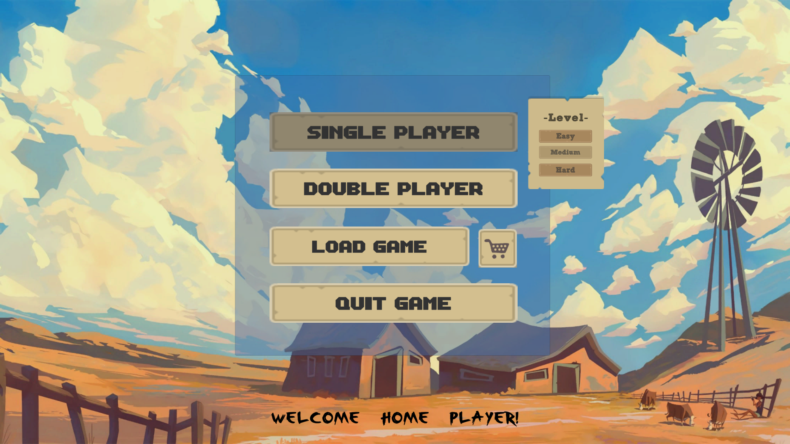

Two players play in turn, the characters can move around and attack and conquer.

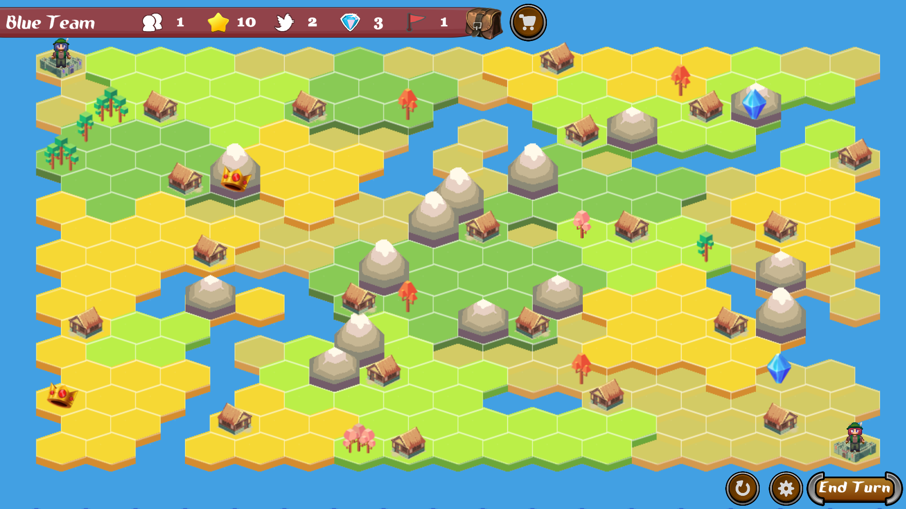

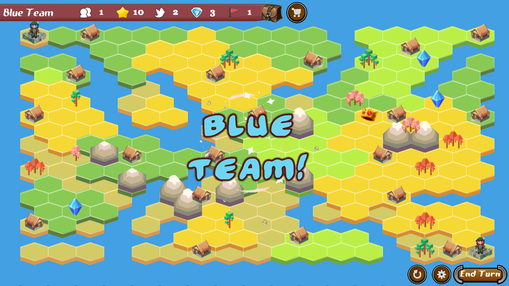

By conquering villages on map, players can recruit new members and also construct villages into particular buildings. The characters have three different occupations: Fighter, Explorer and Scholar. 

Camp is used for training characters which could improve their strength and health.

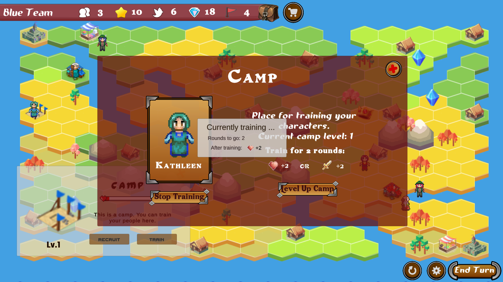

The technology tree can be evolved by scholars to learn more technology, so that corresponding goods could be unlocked in the market for purchase.

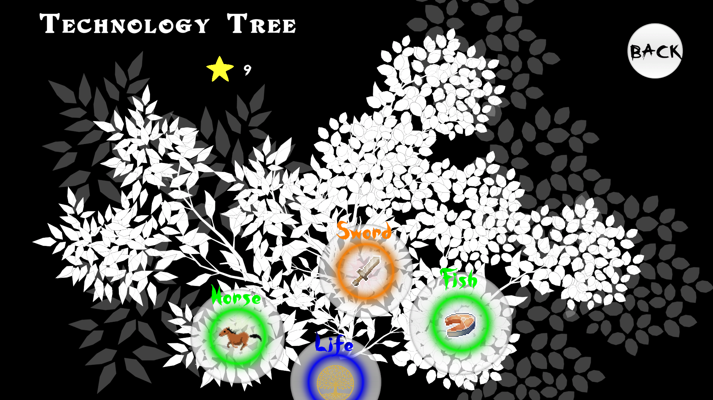

The market is the entrance to the shop, where players can by equipment and goods for characters.

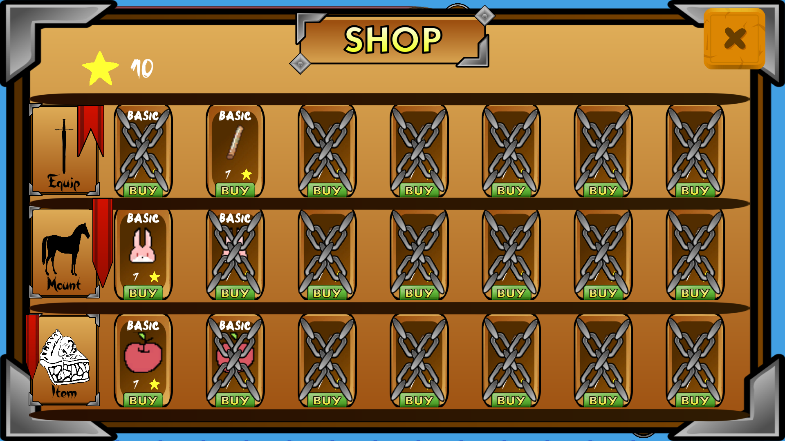

The backpack shows all currently held objects.

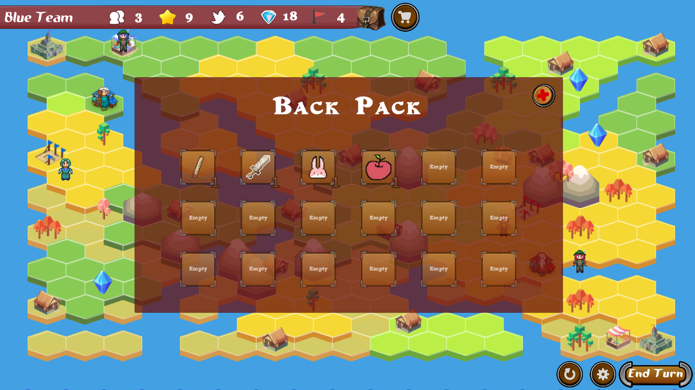

The single player mode game supports saving and resuming, and also the redo of movements.

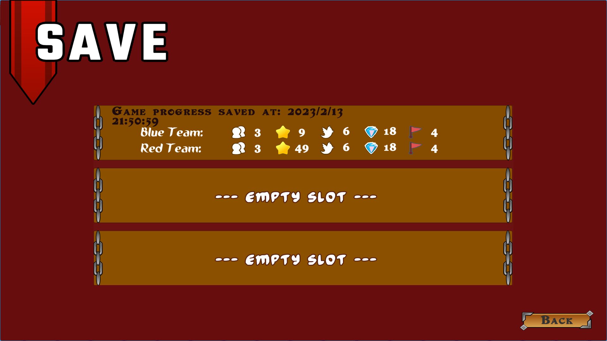

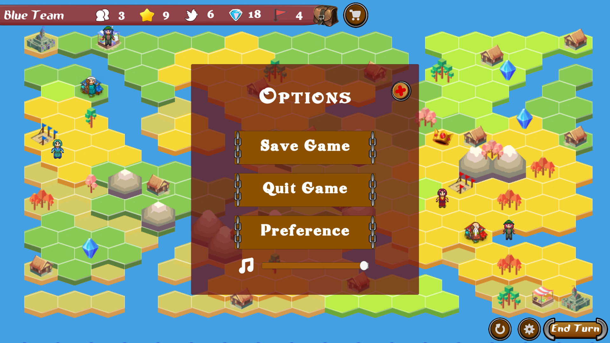

The preference shop could change the characters' appearances as the player prefers.

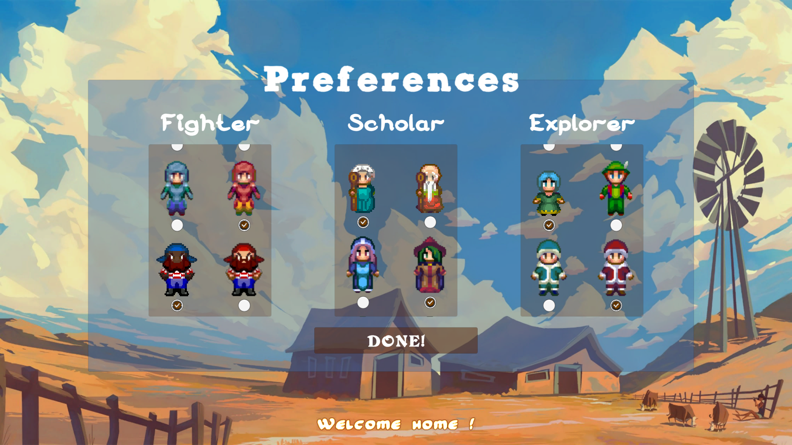

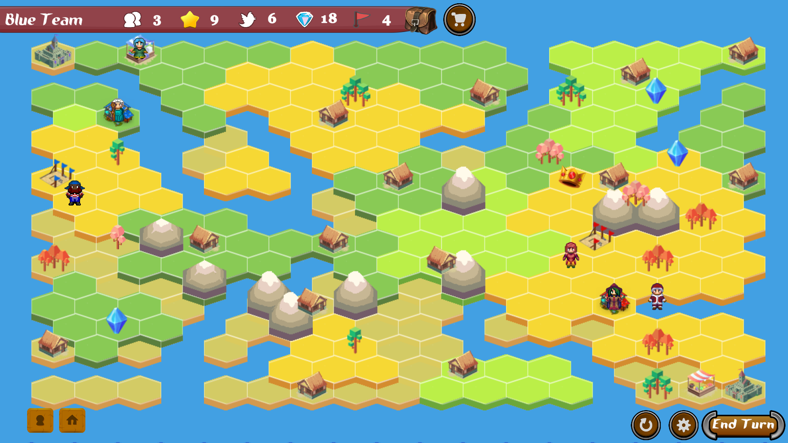